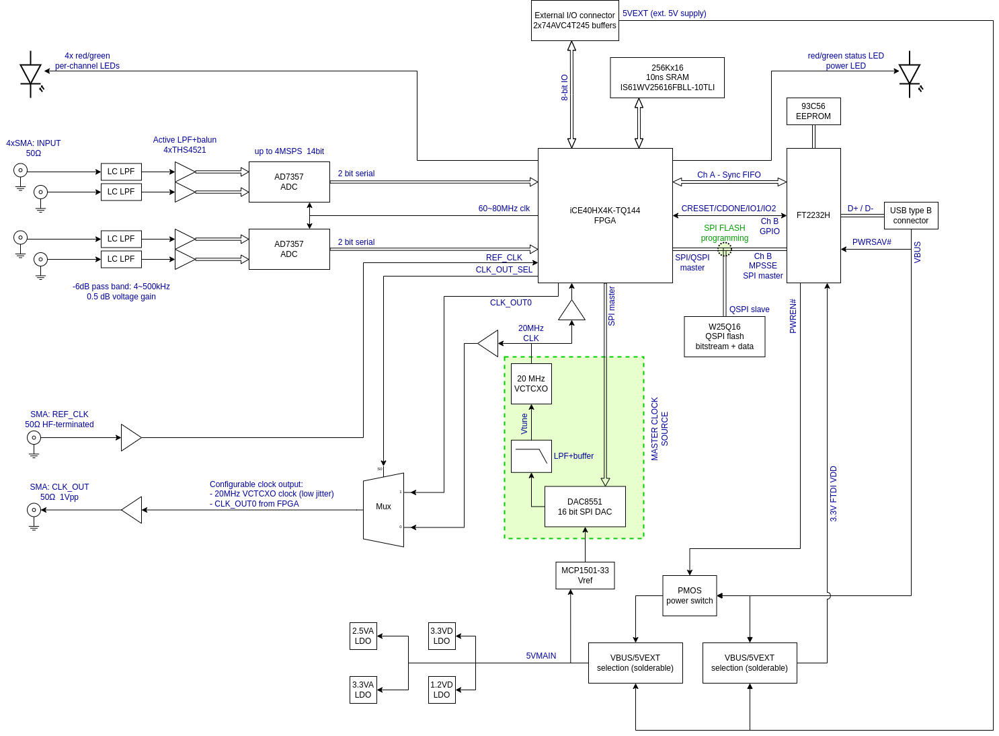

# What

**LWDO-SDR** is an experimental device for wide-band LF/VLF radio reception and using LF/VLF signals for precise timekeeping and generic DSP/SDR research purposes.

The name LWDO-SDR *(**l**ong-**w**ave **d**isciplined **o**scillator with **s**oftware **d**efined **r**adio)* is a moniker aking to a widely-used *GPSDO* term, but instead of GPS we use signals transmitted within long wave radio band, and SDR for signal processing.

# Goals

LWDO-SDR is built upon following ideas:
- Wide dynamic range capture of the whole LF/VLF radio spectrum (up to 500 KHz)
  - Simultaneous reception of any number of stations
  - Exposing it as a WebSDR (for the fun of it?)
- Precise built-in VCTCXO oscillator
  - Generates tightly controlled ADC sample clock that allows for SDR processing using large-time-constant averaging
  - Digitally-controlled (via 16 bit DAC), and can be disciplined by:
    - External 1 PPS or 1,2,5,10MHz reference (via DPLL)
    - Received radio signals
- Synchronous capture from multiple antennas (up to 4)
  - Experiments with urban noise suppression SDR algorithms 
  - Directional reception (using e.g. two or three loop antennas)
- Raw data streaming over USB High Speed interface, processing on the USB host device (PC, RaspberryPi, etc.)
  - Because we don't want to be limited by computing power of an embedded MCU or DSP
- Single PCB, two form-factors:
  - Standalone, USB bus-powered - for ease of use and portability (uses Hammond 1455P1601 case)
  - Embedded, self-powered - for use within e.g. a standalone clock source unit within the home lab.

Some signals that can be received by LWDO-SDR are:
- [DCF77 - 77.5KHz](https://en.wikipedia.org/wiki/DCF77)
- [MSF - 60 KHz](https://en.wikipedia.org/wiki/Time_from_NPL_(MSF))
- [RBU - 66.67 KHz](https://en.wikipedia.org/wiki/RBU_(radio_station))
- [TDF - 162 KHz](https://en.wikipedia.org/wiki/ALS162_time_signal)
- [Loran - 100 KHz](https://en.wikipedia.org/wiki/Loran-C)

# Drawings

PDF renders:
- [Schematic](./doc/schematic-rev1.0.pdf)
- [PCB visualisation](./doc/pcb-rev1.0.pdf)

Curious ones are kindly asked to look into the original KiCad 6.0.4 CAD files, which include full PCB drawings and BOM information.

Photo of assembled board can be seen [here](./doc/pcb-photo-rev1.0.jpg).

# HW description

### FPGA

The core of the LWDO-SDR is a low-end FPGA - *ICE40HX4K-TQ144* - that has:
- 3520x 4-input LUT, 1 FF logic cells (7680x with Yosys toolchain)
- 20x 4kbit dual-port block RAM cells (32x with Yosys)
- 2x PLLs
- DDR IO cells
- No hardware multipliers
- Typically achievable clock rates of 40~100MHz (depending on the design)

This FPGA has been chosen for its price and hobbyist-friendliness: TQFP144 can be soldered by hand and allows using 2-layer PCB. However, it is rather small so e.g. it may not be possible to use any kind of softCPU there (remains to be seen..). Any kind of sophisticated DSP is also out of the question, since there are no hardware multipliers.

The bitstream together with any extra user data is stored within 2 MByte QSPI flash - *W25Q16JV*.

FPGA is also connected to a 10 ns 512 KByte SRAM with 16 bit data bus - *IS61WV25616FBLL-10TLI*. At this moment it is not clear how much useful the SRAM may be, given overall FPGA footprint constraints.

### USB

USB 2.0 High Speed is implemented by FTDI FT2232H chip. It has two external channels, allocated as follows:
- Channel A - synchronous FIFO - allows data streaming from/to FPGA up to 40 MByte/s over USB bulk endpoints
- Channel B - MPSSE (SPI) + GPIO - to program bitstream SPI flash and handle CRESET, CDONE, and a pair of extra GPIO-like signals from FPGA (similar to how it's done on the [iCEstick](https://www.latticesemi.com/icestick). Available only when channel A is not in use.

### RF front-end

The board features four input channels for RF signals. All channels are the same:
1. 50 ohm DC-terminated SMA connector.
2. SD12C TVS ESD / overvoltage suppressor.
3. 2nd (3rd) order LC LPF (-3dB cutoff circa 530 KHz, rolloff 12 dB/oct).
4. Schottky diode overvoltage protection.
5. THS4521 fully-differential amplifier, performing unbalanced-balanced conversion and connected as a 2nd order LPF (-3dB cutoff circa 460 KHz, rolloff 12 dB/oct).
6. Passive RC LPF providing tank capacitance for driving the ADC (-3dB cutoff circa 1 MHz, rolloff 6 dB/oct)

### ADC

Board uses two [AD7357](https://www.analog.com/media/en/technical-documentation/data-sheets/AD7357.pdf), which is a 2-ch simulatenous-sampling 4.2 MSPS 14 bit SAR ADC. The output from each ADC is 2-bit serial bus. At a max sampling rate of 4.2 MSPS this ADC requires serial clock circa 80 MHz, which is provided by the FPGA.

**Note** to achieve timing closure for FPGA-ADC interface, taking into account propagation delays, setup times of ICE40HX IO cells, and especially AD7357 data valid delay (up to 9 ns), the generated clock is resampled on the FPGA pin:
- ICE40 outputs clock on the SCLK line (pin 15 or 20).
- ICE40 samples SCLK line via the input buffer of pin 20, and feeds that clock to the global clock net.
Compared to simply driving internal clock to the pin, this allows to take "global clock net -> pin output" delay (circa 2.5 ns) out of the timing equation.

### Clock source

[DOT050V-020.0M](http://www.conwin.com/datasheets/tx/tx395.pdf) VCTCXO from Connor-Winfield provides master 20 MHz clock for the FPGA, from which all the other clocks are generated using on-die PLLs.
DOT050V is a highly stable precision oscillator. Notable specs are:
- Factory frequency calibration: ±1 ppm
- Stability vs temperature 0~70 °C: ±50 **ppb**
- Stability vs load, supply voltage: ±20 ppb
- Aging over first year: ±300 ppb
- Voltage control frequency pulling range: at least ±10 ppm
- Comes in a standard 9x14mm SMT package

If needed, DOT050V can be easily replaced by some other, potentially cheaper, 3.3V VCTCXO or VCXO directly or through a simple adapter PCB (or DIY-style: some Kynar wire and hot glue). LWDO-SDR contains buffering circuitry that can accept oscillators with both square wave and (clipped) sine wave output.

The oscillator is voltage-controlled through by means of:
- 16-bit SPI DAC [DAC8551](https://www.ti.com/lit/ds/symlink/dac8551.pdf) driven by SPI master implemented on FPGA.
- DAC Vref provided by [MCP1501](https://ww1.microchip.com/downloads/en/DeviceDoc/20005474E.pdf), powered from filtered, unregulated 5V rail. 
- 1st order passive RC LPF (-3dB cutoff circa 160 Hz).
- Non-inverting buffer using [NCS325](www.onsemi.com/pub/Collateral/NCS325-D.PDF) rail-to-rail low-drift low-offset precision OpAmp.

### External clock input and output

There are two extra SMA connectors: one is for external clock input, one is for clock output from the board.

Clock output provides 1 Vpkpk 50 ohm terminated square wave output, AC or DC coupled (controlled by jumper). Output clock may come from one of two sources:
1. Dedicated FPGA pin.
2. 20 MHz master clock from VCTCXO.
The source is selected via a hardware LVCMOS multiplexer chip, controlled by the FPGA.

External clock input is 50 ohm terminated (above ~3MHz), AC or DC coupled. It is buffered and squared by a chain of unbuffered and buffered LVCMOS inverters, and fed to a dedicated FPGA pin.

**NOTE** clock input circuitry depicted on the schematic is sub-optimal. See "Errata" section below.

### External I/O

To allow LWDO-SDR PCB to be embedded, there's a 20-pin IDC ribbon cable connector which provides:
- 8 bit I/O bus connected to the FPGA:
  - Buffered via unidirectional 74AVC4T245 level translators.
  - Direction control for I/O lines is manual, by soldering/desoldering bridge resistors onto PCB.
  - Wired to a ribbon cable in G-S-G order, impedance-matched to a standard 1.27mm-pitch cable.
- External VDDIO supply for the level translators.
- External 5V supply for powering up the board (instead of using USB VBUS).

### LEDs

Board has 6 red/green bi-LEDs [WP130WCP/2EGW](https://www.kingbrightusa.com/images/catalog/SPEC/WP130WCP-2EGW.pdf):
- 4 for monitoring input status (located next to the input connectors)
- 1 for monitoring system status (located next to the USB)
- 1 hard-wired as a green power LED (located next to the USB)

### PCB

The board itself is 2-layer, designed to be manufacturable by [Eurocircuits](https://www.eurocircuits.com/) PCB Proto service according to Class 5C (0.175mm track, 0.25mm annular ring, 0.25mm smallest final hole).

# Software

The testing of rev 1.0 board is, as of 10 May 2022, currently ongoing. The software development is WIP. Source code of FPGA and host SW will be published on GitHub as soon as I have something ready.

# Errata

### Issue 1 - CLK_IN buffer instability

**Symptom:** when AC-coupled, in absence of input signal, or when input signal is weak or slowly-changing (low frequency sine wave), the output of clock buffer contains a lot of random 0->1, 1->0 transitions.

**Cause:** input buffer, implemented with 2x LVCMOS unbuffered invertors, has very high analog gain (circa 40~50dB). That amplifies all kinds of noise when the input signal is not strong enough. Buffered LVCMOS invertors ampify and square that noise signal even further.

**Solution:** problem can be solved by adding hysteresis (Schmitt-trigger action) to the input buffer. For that, an extra 100K resistor needs to be soldered on top of the PCB per schematic shown below:

[Errata-1-rework-schematic](./doc/errata-issue1-rework.png)

# License

Copyright 2022 Roman Dobrodii

SPDX-License-Identifier: Apache-2.0 WITH SHL-2.1

Licensed under the Solderpad Hardware License v 2.1 (the “License”); you may not
use this work except in compliance with the License, or, at your option, the
Apache License version 2.0. You may obtain a copy of the License at

https://solderpad.org/licenses/SHL-2.1/

Unless required by applicable law or agreed to in writing, any work distributed
under the License is distributed on an “AS IS” BASIS, WITHOUT WARRANTIES OR
CONDITIONS OF ANY KIND, either express or implied. See the License for the
specific language governing permissions and limitations under the License.
